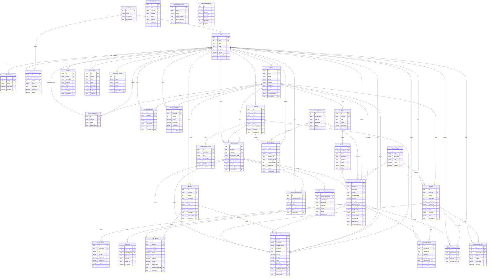

```mermaid
erDiagram

  %% ============================================================
  %% AUTH / USUARIOS
  %% ============================================================

  Role {
    int id PK
    string name
    string description
    json permissions
  }

  User {
    uuid id PK
    int roleId FK
    string name
    string email
    string phone
    boolean isActive
    boolean whatsappOptIn
    datetime lastLogin
  }

  RefreshToken {
    bigint id PK
    uuid userId FK
    string token
    datetime expiresAt
    boolean revoked
  }

  Invitation {
    bigint id PK
    string email
    int roleId FK
    string token
    uuid invitedById FK
    datetime expiresAt
    datetime usedAt
  }

  %% ============================================================
  %% PROYECTOS
  %% ============================================================

  Project {
    uuid id PK
    string code
    string name
    string client
    string location
    date startDate
    date endDate
    enum status
    decimal estimatedBudget
    uuid createdById FK
  }

  ProjectAssignment {
    uuid id PK
    uuid projectId FK
    uuid userId FK
    uuid assignedById FK
  }

  ProjectAddendum {
    uuid id PK
    uuid projectId FK
    int number
    decimal amount
    string description
    date date
    uuid createdById FK
  }

  ProjectCubicacion {
    uuid id PK
    uuid projectId FK
    int number
    decimal amount
    decimal progressPct
    string description
    date date
    uuid createdById FK
  }

  %% ============================================================
  %% GASTOS
  %% ============================================================

  ExpenseCategory {
    int id PK
    string name
    string description
    string icon
    boolean isActive
    boolean isSystem
  }

  CompanyCard {
    int id PK
    string holderName
    string lastFour
    string cardType
    string bank
    boolean isActive
  }

  Expense {
    uuid id PK
    uuid projectId FK
    int categoryId FK
    uuid userId FK
    date expenseDate
    decimal amount
    string description
    enum paymentMethod
    int companyCardId FK
    boolean hasFiscalDoc
    enum status
    uuid approvedById FK
    uuid voidedById FK
    string batchItemId FK
    string contratoAjustadoId FK
  }

  FiscalVoucher {
    uuid id PK
    uuid expenseId FK
    string ncf
    string ncfType
    boolean isElectronic
    string supplierRnc
    string supplierName
    decimal itbisAmount
  }

  Attachment {
    uuid id PK
    uuid expenseId FK
    uuid uploadedById FK
    string fileName
    string filePath
    string mimeType
    boolean isPrimary
  }

  Batch {
    uuid id PK
    uuid projectId FK
    string code
    string name
    decimal totalBudget
    string status
  }

  BatchItem {
    uuid id PK
    uuid batchId FK
    string code
    string description
    string provincia
    string sector
    decimal budget
    string status
  }

  %% ============================================================
  %% NOMINAS
  %% ============================================================

  Payroll {
    uuid id PK
    uuid projectId FK
    int number
    date periodStart
    date periodEnd
    enum type
    enum status
    decimal totalAmount
    uuid createdById FK
    uuid approvedById FK
    uuid voidedById FK
  }

  PayrollLine {
    uuid id PK
    uuid payrollId FK
    int lineNumber
    string description
    decimal quantity
    string unit
    decimal unitPrice
    decimal subtotal
    string supplierName
    uuid contratoAjustadoId FK
    uuid expenseId FK
  }

  %% ============================================================
  %% ORDENES DE PAGO
  %% ============================================================

  Supplier {
    uuid id PK
    string name
    string rnc
    string phone
    string email
    string bank
    string accountNumber
    boolean isActive
    uuid createdById FK
  }

  SupplierBankAccount {
    uuid id PK
    uuid supplierId FK
    string bank
    string accountType
    string accountNumber
    string currency
    boolean isDefault
  }

  PaymentOrder {
    uuid id PK
    int number
    string orderType
    string payingCompany
    uuid supplierId FK
    uuid projectId FK
    decimal amount
    string concept
    string status
    uuid payrollId FK
    uuid expenseId FK
    uuid contratoAjustadoId FK
    uuid quotationId FK
    uuid createdById FK
  }

  %% ============================================================
  %% COTIZACIONES
  %% ============================================================

  Quotation {
    uuid id PK
    uuid projectId FK
    int number
    int categoryId FK
    string supplierName
    string supplierRnc
    date quotationDate
    decimal total
    string currency
    enum status
    uuid createdById FK
  }

  QuotationPayment {
    uuid id PK
    uuid quotationId FK
    uuid expenseId FK
    int sequence
    decimal amount
    date paymentDate
    enum paymentMethod
    uuid createdById FK
  }

  QuotationExpenseLink {
    uuid id PK
    uuid quotationId FK
    uuid expenseId FK
    enum linkType
    uuid createdById FK
  }

  QuotationAttachment {
    uuid id PK
    uuid quotationId FK
    uuid uploadedById FK
    string fileName
    string filePath
    string mimeType
    boolean isPrimary
  }

  %% ============================================================
  %% CONTRATOS AJUSTADOS
  %% ============================================================

  ContratoAjustado {
    uuid id PK
    uuid projectId FK
    uuid supplierId FK
    string descripcionTrabajo
    decimal montoContratado
    date fechaContrato
    enum estado
    uuid createdById FK
    uuid updatedById FK
  }

  ContratoAjustadoAdenda {
    uuid id PK
    uuid contratoAjustadoId FK
    int number
    decimal monto
    string descripcion
    date fecha
    uuid createdById FK
  }

  ContratoAjustadoPago {
    uuid id PK
    uuid contratoAjustadoId FK
    uuid ordenPagoId
    uuid nominaId
    uuid gastoId
    decimal monto
    date fecha
    uuid creadoPorId FK
  }

  %% ============================================================
  %% SISTEMA
  %% ============================================================

  AuditLog {
    bigint id PK
    uuid userId FK
    string tableName
    string recordId
    enum action
    json oldData
    json newData
    string ipAddress
  }

  SystemLog {
    uuid id PK
    string level
    string category
    string message
    json details
    string endpoint
    int statusCode
    int duration
  }

  HealthCheckResult {
    uuid id PK
    string status
    boolean dbOk
    float memoryUsedPct
    float uptimeSeconds
    int responseTime
  }

  Notification {
    uuid id PK
    uuid userId FK
    string type
    string title
    string message
    string link
    boolean isRead
    string entityId
  }

  NotificationContact {
    uuid id PK
    string name
    string phone
    string email
    boolean isActive
    uuid createdById FK
  }

  ServiceSubscription {
    uuid id PK
    string name
    string provider
    decimal monthlyCost
    string currency
    int billingDay
    boolean isActive
  }

  OfficeExpense {
    uuid id PK
    enum category
    string description
    decimal amount
    date expenseDate
    enum paymentMethod
    int companyCardId FK
    uuid supplierId FK
    enum status
    uuid createdById FK
  }

  %% ============================================================
  %% RELATIONSHIPS — Auth/Usuarios
  %% ============================================================

  Role ||--o{ User : "tiene"
  Role ||--o{ Invitation : "asigna"
  User ||--o{ RefreshToken : "posee"
  User ||--o{ Invitation : "envía (invitedBy)"
  User ||--o{ AuditLog : "genera"
  User ||--o{ Notification : "recibe"
  User ||--o{ NotificationContact : "crea"

  %% ============================================================
  %% RELATIONSHIPS — Proyectos
  %% ============================================================

  User ||--o{ Project : "crea"
  Project ||--o{ ProjectAssignment : "tiene"
  User ||--o{ ProjectAssignment : "asignado"
  User ||--o{ ProjectAssignment : "asigna (assignedBy)"
  Project ||--o{ ProjectAddendum : "tiene"
  User ||--o{ ProjectAddendum : "crea"
  Project ||--o{ ProjectCubicacion : "tiene"
  User ||--o{ ProjectCubicacion : "crea"

  %% ============================================================
  %% RELATIONSHIPS — Gastos
  %% ============================================================

  Project ||--o{ Expense : "contiene"
  ExpenseCategory ||--o{ Expense : "clasifica"
  User ||--o{ Expense : "registra"
  CompanyCard |o--o{ Expense : "paga con"
  Expense ||--o| FiscalVoucher : "tiene"
  Expense ||--o{ Attachment : "tiene"
  BatchItem |o--o{ Expense : "agrupa"
  Batch ||--o{ BatchItem : "contiene"
  Project ||--o{ Batch : "tiene"

  %% ============================================================
  %% RELATIONSHIPS — Nominas
  %% ============================================================

  Project ||--o{ Payroll : "tiene"
  User ||--o{ Payroll : "crea"
  Payroll ||--o{ PayrollLine : "contiene"
  ContratoAjustado |o--o{ PayrollLine : "vincula"
  Expense |o--o| PayrollLine : "genera"

  %% ============================================================
  %% RELATIONSHIPS — Ordenes de Pago
  %% ============================================================

  Supplier ||--o{ SupplierBankAccount : "tiene"
  Supplier ||--o{ PaymentOrder : "recibe"
  Project ||--o{ PaymentOrder : "genera"
  User ||--o{ PaymentOrder : "crea"
  Payroll |o--o| PaymentOrder : "origina"
  Expense |o--o| PaymentOrder : "origina"
  ContratoAjustado |o--o{ PaymentOrder : "origina"
  Quotation |o--o{ PaymentOrder : "origina"
  User ||--o{ Supplier : "crea"

  %% ============================================================
  %% RELATIONSHIPS — Cotizaciones
  %% ============================================================

  Project ||--o{ Quotation : "tiene"
  ExpenseCategory |o--o{ Quotation : "clasifica"
  User ||--o{ Quotation : "crea"
  Quotation ||--o{ QuotationPayment : "tiene"
  Quotation ||--o{ QuotationExpenseLink : "tiene"
  Quotation ||--o{ QuotationAttachment : "tiene"
  Expense |o--o| QuotationPayment : "vincula"
  Expense ||--o| QuotationExpenseLink : "vincula"
  User ||--o{ QuotationPayment : "registra"
  User ||--o{ QuotationExpenseLink : "registra"
  User ||--o{ QuotationAttachment : "sube"

  %% ============================================================
  %% RELATIONSHIPS — Contratos Ajustados
  %% ============================================================

  Project ||--o{ ContratoAjustado : "tiene"
  Supplier ||--o{ ContratoAjustado : "ejecuta"
  User ||--o{ ContratoAjustado : "crea"
  ContratoAjustado ||--o{ ContratoAjustadoAdenda : "tiene"
  ContratoAjustado ||--o{ ContratoAjustadoPago : "registra"
  User ||--o{ ContratoAjustadoAdenda : "crea"
  ContratoAjustado |o--o{ Expense : "vincula"

  %% ============================================================
  %% RELATIONSHIPS — Sistema
  %% ============================================================

  User ||--o{ OfficeExpense : "registra"
  CompanyCard |o--o{ OfficeExpense : "paga con"
  Supplier |o--o{ OfficeExpense : "cobra"
```
